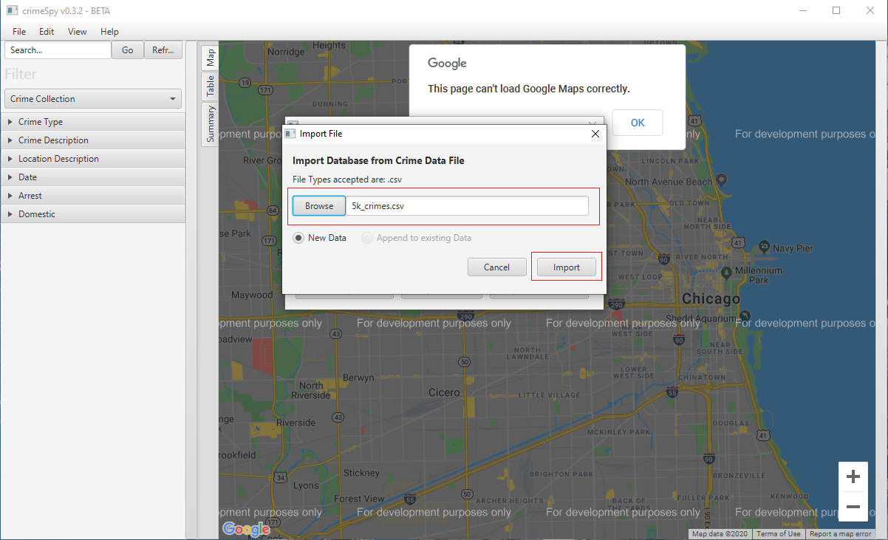

                               _                  _____                       __   ____
                  _____ _____ (_)____ ___   ___  / ___/ ____   __  __        / /  / __ \
                 / ___// ___// // __ `__ \ / _ \ \__ \ / __ \ / / / /       / /  / / / /
                / /__ / /   / // / / / / //  __/___/ // /_/ // /_/ /       / /_ / /_/ /
                \___//_/   /_//_/ /_/ /_/ \___//____// .___/ \__, /       /_/(_)\____/
                                                    /_/     /____/

## Running the application.
### From command prompt:
1. Open the command prompt
2. Navigate to the samples folder the crimeSpy.jar file
3. Run crimeSpy Program
    Linux  :> java -jar crimeSpy.jar
    Windows:> java -jar crimeSpy.jar

## Data
New data can be obtained from [here](https://data.cityofchicago.org/Public-Safety/Crimes-2001-to-present/ijzp-q8t2).

## Tutorial
On sterting the CrimeSpy application the following will appera:

  

Clicking on either "Import a .csv" or "Open a Database" will allow you to either import a saved or downloaded csv or open a CrimeSpy created .db file. For now we will import a .csv. A sample .csv file (5k_crimes.csv) can be found inside the samples directory. 

  

After the file has been selected click import and we selected the dataset. THe dataset can be selected by clicking the "crime collection" drop down inside the filter panel. 

  

Now that the dataset has been selected you should be able to see pin in the map pane. The three viewing panes can be selected by either click there button on the side next to the filter pane or by clicking view in the menu bar and then clicking the pane you want to view.

  

The dataset can be filtered by selection various option in the filter pane. For example we can filter te data to only include criminal damge by selecting it in the filter pane.

  

As there is limit to how many pins can be selected on the map you can switch to heatmap view to see where crimes are most prevalent. 

  

