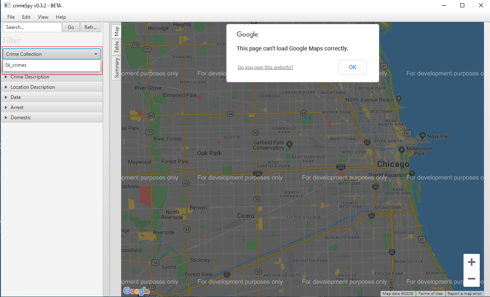
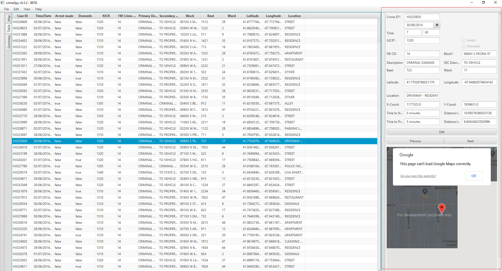
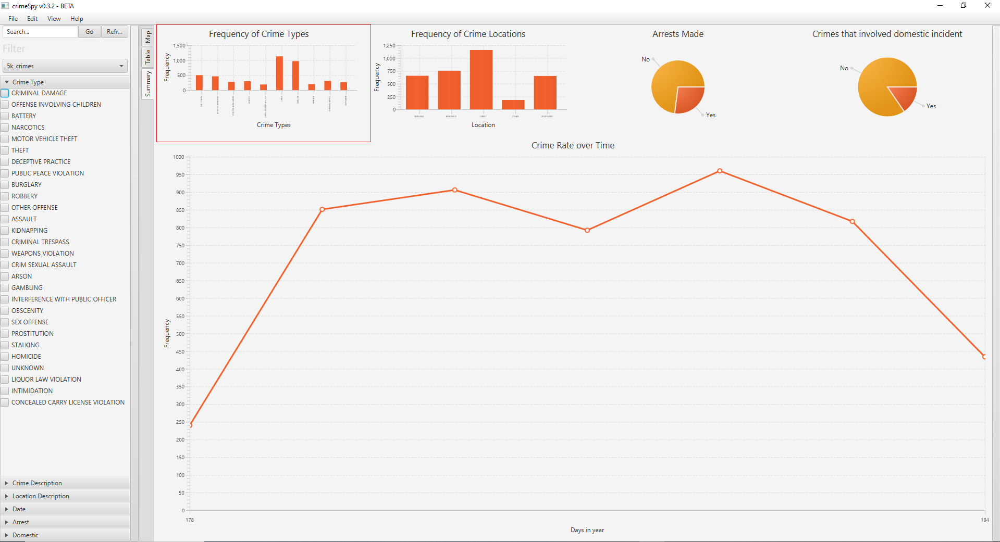
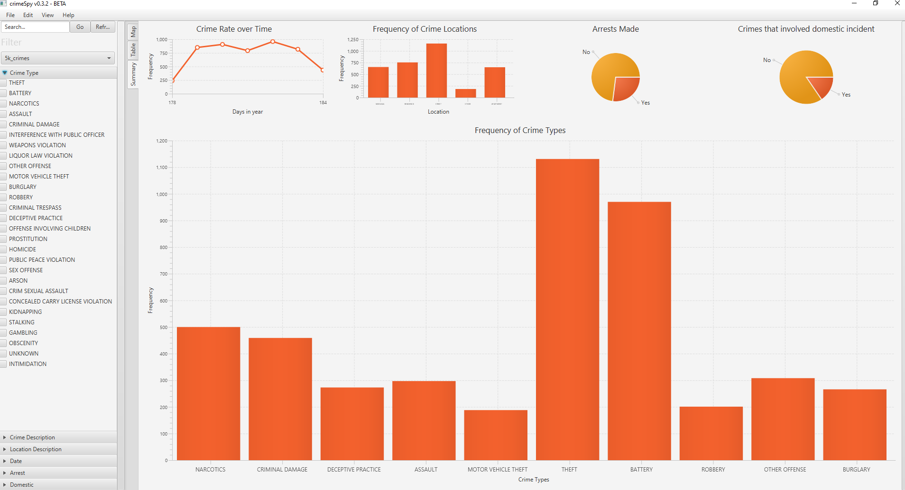

                               _                  _____                       __   ____
                  _____ _____ (_)____ ___   ___  / ___/ ____   __  __        / /  / __ \
                 / ___// ___// // __ `__ \ / _ \ \__ \ / __ \ / / / /       / /  / / / /
                / /__ / /   / // / / / / //  __/___/ // /_/ // /_/ /       / /_ / /_/ /
                \___//_/   /_//_/ /_/ /_/ \___//____// .___/ \__, /       /_/(_)\____/
                                                    /_/     /____/

## Running the application.
### From command prompt:
1. Open the command prompt
2. Navigate to the samples folder the crimeSpy.jar file
3. Run crimeSpy Program
    Linux  :> java -jar crimeSpy.jar
    Windows:> java -jar crimeSpy.jar

## Data
New data can be obtained from [here](https://data.cityofchicago.org/Public-Safety/Crimes-2001-to-present/ijzp-q8t2).

## Tutorial
On starting the CrimeSpy application the following introduction screen will appear.

  

Clicking on either "Import a .csv" or "Open a Database" will allow you to either import a saved or downloaded csv or open a CrimeSpy created .db file. For now, we will import a .csv, a sample .csv file (5k_crimes.csv) can be found inside the samples directory. 

  

After the file has been selected click import the. The dataset can now be selected by clicking the "Crime Collections" dropdown inside the filter panel. 

  

Now that the dataset has been selected you should be able to see location pins appear in the map pane. The three viewing panes can be selected by either click a tab button on the side next to the filter pane or by clicking View in the menu bar and then clicking the either Map, Table or Summary.

  

The dataset can be filtered by selecting various options in the filter pane. For example, we can filter the data to only include criminal damage by selecting it in the filter pane.

  

As there is a limit to how many pins can be selected on the map you can switch to heatmap view to see where crimes are most prevalent. 

  

Clicking on the table view, you can see a spreadsheet of data, on double-clicking a table row a pane on the right will pop out showing information about the row. The filter pane can also be minimised by clicking the left verticle button, which then enables more rows to read in the table view.

  

The right pane displays the data of the row and also includes a map at the bottom of the pane showing the local area where the crime occurred. The right pane can also be used to edit, delete or reset table entries. Rows can also be deleted directly on the spreadsheet pressing the DEL key.

  

The final feature we will go through is the summary statistics view. The plots can be enlarged into the centre by double-clicking on the plot you want to enlarge.

  

  

